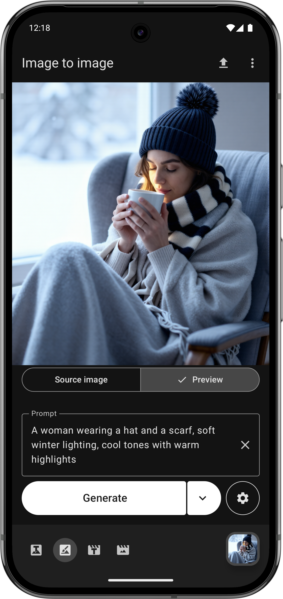
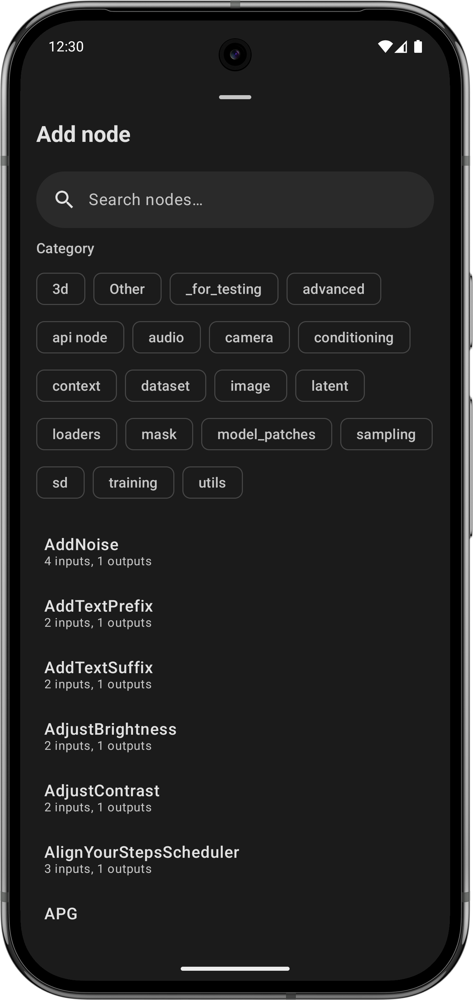

# ComfyChair

An unofficial, native Android UI for [ComfyUI](https://github.com/comfyanonymous/ComfyUI).

**Current version**: v0.8.2

## Overview

ComfyChair provides a streamlined mobile interface for interacting with ComfyUI servers, allowing you to generate and manage AI images and videos directly from your Android device. The app communicates with your ComfyUI server via its API, bringing the power of node-based AI generation to your mobile workflow.

**Note**: This is an independent, community-developed project and is not officially affiliated with or endorsed by the ComfyUI team.

## Screenshots

           

## Features

### General

- **Server connection**: Connect to remote or local ComfyUI servers with automatic HTTP/HTTPS detection and self-signed certificate support
- **Queue management**: Submit multiple jobs without waiting, view queue count, cancel current job, add to front of queue, or clear queue entirely
- **Dual workflow support**:
  - **Checkpoint mode**: Traditional CheckpointLoaderSimple workflows
  - **UNET mode**: Modern diffusion workflows (Flux, Z-Image, etc.) with separate UNET, VAE, and CLIP model selection
- **LoRA chain support**:
  - Add up to 5 LoRAs per chain with individual strength control (0.0-2.0)
  - Text to image and Image to image: Separate LoRA chains for Checkpoint and UNET modes
  - Text to video and Image to video: Separate High noise and Low noise LoRA chains
  - LoRAs are dynamically injected into workflows at generation time
- **Localization**: Available in English (default), German, French, Polish, Spanish, and Chinese
- **Native Android experience**: Built with Kotlin and Jetpack Compose with Material Design 3

### Supported modes

- **Text to image**:
  - Mobile-optimized interface with live progress updates
  - Live preview images during generation (when supported by server)
- **Image to image**:
  - Two modes: **Editing** (transformation) and **Inpainting** (mask-based)
  - **Editing mode**: Transform images with optional reference images (up to 2)
  - **Inpainting mode**: Mask editor with adjustable brush size and feathered edges
  - Live progress updates and preview images during generation
- **Text to video**:
  - Generate AI videos with high/low noise UNET and LoRA model selection
  - Live preview during generation
- **Image to video**:
  - Animate still images into videos with adjustable length and frame rate
  - High/low noise UNET and LoRA model selection
  - Live preview during generation

### Media

- **Media viewer**:
  - Unified fullscreen viewer for images and videos
  - Material Design 3 Expressive UI with floating toolbar and FAB
  - Swipe navigation between gallery items with tonal navigation buttons
  - Pinch-to-zoom and double-tap to toggle between fit and crop zoom
  - Single-tap to toggle UI visibility (with system bars)
  - Quick actions: delete, save to gallery, share, view metadata
  - Metadata viewer showing generation parameters (prompt, model, seed, steps, etc.)
  - Optimized media caching for smooth transitions between items
- **Gallery**:
  - View all generated images and videos with 2-column grid layout
  - Video indicator on thumbnails
  - Pull-to-refresh to update gallery
  - Multi-select mode with long press to select items
  - Batch operations: save, share, or delete multiple items at once
- **Media management**: Save to device gallery (Pictures/ComfyChair or Movies/ComfyChair) or share

### Workflows

- **Full node graph visualization**: Colored nodes and connections matching ComfyUI's visual style
- **Node management**:
  - Add nodes via searchable Node Browser with category filter chips
  - Delete, duplicate, bypass, and rename nodes
  - Cleanup tool to remove disconnected nodes
- **Connection management**:
  - Create connections by tapping an output socket and then an input socket
  - Target sockets glow when compatible during connection creation
  - Delete connections via node context menu or by selecting and deleting
  - Selected nodes highlight all their connections
- **Node attribute editing**:
  - Side sheet editor for node parameters (tap nodes to edit)
  - Boolean values displayed as on/off toggles
  - Image previews for image selector fields
  - Template values highlighted with "UI:" prefix
  - Connected inputs styled with wire colors
  - Edited values highlighted for easy identification
- **Navigation and zoom**:
  - Material Design 3 Expressive floating toolbar
  - Zoom controls with percentage display
  - Fit all / Fit width zoom options
- **Workflow management**:
  - Create workflows from scratch or import existing ones exported from ComfyUI
  - Dynamic workflow thumbnails showing mini graph previews
  - Context menus for edit, rename, duplicate, export, and delete
  - Field mapping UI for required template fields
  - Per-workflow generation settings persistence

### Configuration

- **Server configuration**:
  - View detailed server information (ComfyUI version, OS, Python, PyTorch versions)
  - Monitor hardware resources (RAM and GPU VRAM usage with free/total display)
  - Server management actions (clear queue, clear history)
- **App management**:
  - Clear local cache (generated images, videos, source images, masks)
  - Restore default settings
  - Backup configuration to JSON file (connection settings, workflow values, custom workflows)
  - Restore configuration from backup
- **Workflow management**:
  - View and manage custom workflows with visual thumbnails
  - Upload custom ComfyUI workflows with automatic validation
  - Edit workflow name and description
  - Default generation settings extracted during workflow import
  - Per-workflow generation settings (each workflow remembers its own configuration)
- **Configuration persistence**: Automatically saves and restores all settings including prompts, models, workflow selections, and generation parameters on a per-workflow basis

## Requirements

- Android 14 (API level 34) or higher
- Access to a running ComfyUI server instance
- Network connectivity to reach your ComfyUI server

## Development setup

### Prerequisites

1. **Android Studio** (latest stable version recommended)
2. **JDK 11** or higher
3. **Android SDK** with API level 36

### Building the project

1. Clone the repository:
   ```bash
   git clone https://github.com/legal-hkr/comfychair.git
   cd comfychair
   ```

2. Set up your local environment:
   - Ensure `JAVA_HOME` is set to your JDK installation
   - Configure Android SDK path in `local.properties`

3. Build the app:
   ```bash
   ./gradlew assembleDebug
   ```

4. Run on device/emulator:
   ```bash
   ./gradlew installDebug
   ```

### Running tests

```bash
# Unit tests
./gradlew test

# Instrumented tests (requires device/emulator)
./gradlew connectedAndroidTest
```

## Configuration

To connect to your ComfyUI server, you'll need:
- ComfyUI server URL (e.g., `http(s)://192.168.1.100:8188`)
- Network access between your Android device and the ComfyUI server

## Tech stack

- **Language**: Kotlin 2.0.21
- **Min SDK**: Android 14 (API 34)
- **Target SDK**: Android 15 (API 36)
- **UI Framework**: Jetpack Compose with Material Design 3 (including Expressive components)
- **Video Playback**: Media3 ExoPlayer
- **Architecture**: MVVM with ViewModels and StateFlow
- **Navigation**: Jetpack Compose Navigation
- **Build system**: Gradle with Kotlin DSL

## Contributing

This project follows standard Android development practices:
- Kotlin coding conventions
- Jetpack Compose best practices
- Material Design 3 guidelines
- MVVM architecture pattern

## License

[GPL-3.0](https://www.gnu.org/licenses/gpl-3.0.en.html)

## Acknowledgments

- [ComfyUI](https://github.com/comfyanonymous/ComfyUI) - The powerful node-based UI this app interfaces with
- [Claude](https://claude.ai) by Anthropic - AI assistant that provided valuable support during the development process, helping with code implementation, architecture decisions, and documentation
