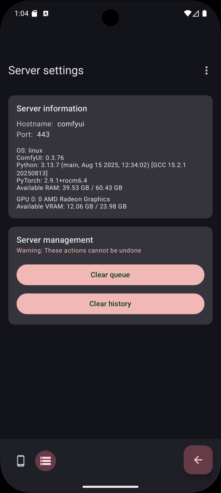

# ComfyChair

A simplified, mobile UI for [ComfyUI](https://github.com/comfyanonymous/ComfyUI) on Android.

**Current version**: v0.4.1

## Overview

ComfyChair provides a streamlined mobile interface for interacting with ComfyUI servers, allowing you to generate and manage AI images and videos directly from your Android device. The app communicates with your ComfyUI server via its API, bringing the power of node-based AI generation to your mobile workflow.

## Screenshots

***UPDATE REQUIRED***

       

## Features

- **Server connection**: Connect to remote or local ComfyUI servers with automatic HTTP/HTTPS detection and self-signed certificate support
- **Dual workflow support**:
  - **Checkpoint mode**: Traditional CheckpointLoaderSimple workflows
  - **UNET mode**: Modern diffusion workflows (Flux, Z-Image, etc.) with separate UNET, VAE, and CLIP model selection
- **Text-to-image generation**:
  - Mobile-optimized interface
  - Cancel generation at any time with one-tap interrupt
  - WebSocket-based live updates showing step-by-step progress
  - Live preview images during generation (when supported by server)
  - Error notifications via Toast messages
- **Text-to-video generation**:
  - Generate AI videos with customizable parameters
  - High/low noise UNET and LoRA model selection
  - Live preview during generation
  - In-loop video playback with center-crop scaling
  - Save videos to device gallery or share
- **Inpainting**:
  - Upload source images for selective inpainting
  - Intuitive mask painting with adjustable brush size
  - Mask inversion and clearing tools
  - Feathered mask edges for smooth blending
  - Megapixels-based sizing for checkpoint workflows
  - WebSocket-based live updates showing step-by-step progress
  - Live preview images during generation (when supported by server)
  - Error notifications via Toast messages
- **Image/Video preview**:
  - Tap to view fullscreen with pinch-to-zoom (images) or play (videos)
- **Gallery**:
  - View all generated images and videos with 2-column grid layout
  - Video indicator on thumbnails
  - Pull-to-refresh to update gallery
  - Multi-select mode with long press to select items
  - Batch operations: save, share, or delete multiple items at once
- **Media management**: Save to device gallery (Pictures/ComfyChair or Movies/ComfyChair) or share
- **Server configuration**:
  - View detailed server information (ComfyUI version, OS, Python, PyTorch versions)
  - Monitor hardware resources (RAM and GPU VRAM usage with free/total display)
  - Server management actions (clear queue, clear history)
- **App management**:
  - Clear local cache (generated images, videos, source images, masks)
  - Restore default settings
- **Configuration persistence**: Automatically saves and restores all settings including prompts, models, workflow selections, and generation parameters
- **Persistent navigation**: Bottom navigation bar for seamless switching between screens
- **Localization**: Available in English (default), German, French, Polish, and Spanish
- **Native Android experience**: Built with Kotlin and Jetpack Compose with Material Design 3

## Requirements

- Android 14 (API level 34) or higher
- Access to a running ComfyUI server instance
- Network connectivity to reach your ComfyUI server

## Development setup

### Prerequisites

1. **Android Studio** (latest stable version recommended)
2. **JDK 11** or higher
3. **Android SDK** with API level 36

### Building the project

1. Clone the repository:
   ```bash
   git clone <repository-url>
   cd ComfyChair
   ```

2. Set up your local environment:
   - Ensure `JAVA_HOME` is set to your JDK installation
   - Configure Android SDK path in `local.properties`

3. Build the app:
   ```bash
   ./gradlew assembleDebug
   ```

4. Run on device/emulator:
   ```bash
   ./gradlew installDebug
   ```

### Running tests

```bash
# Unit tests
./gradlew test

# Instrumented tests (requires device/emulator)
./gradlew connectedAndroidTest
```

## Configuration

To connect to your ComfyUI server, you'll need:
- ComfyUI server URL (e.g., `http://192.168.1.100:8188`)
- Network access between your Android device and the ComfyUI server

## Tech stack

- **Language**: Kotlin 2.0.21
- **Min SDK**: Android 14 (API 34)
- **Target SDK**: Android 15 (API 36)
- **UI Framework**: Jetpack Compose with Material Design 3
- **Video Playback**: Media3 ExoPlayer
- **Architecture**: MVVM with ViewModels and StateFlow
- **Navigation**: Jetpack Compose Navigation
- **Build system**: Gradle with Kotlin DSL

## Project structure

```
app/src/main/
├── java/sh/hnet/comfychair/
│   ├── MainActivity.kt              # Login/connection screen (Compose)
│   ├── MainContainerActivity.kt     # Main container with bottom navigation
│   ├── SettingsContainerActivity.kt # Settings container activity
│   ├── GalleryContainerActivity.kt  # Gallery container activity
│   ├── ComfyUIClient.kt             # API client for ComfyUI server
│   ├── WorkflowManager.kt           # Workflow JSON management
│   ├── SelfSignedCertHelper.kt      # SSL certificate handling
│   ├── navigation/
│   │   └── AppNavigation.kt         # Navigation route definitions
│   ├── viewmodel/
│   │   ├── GenerationViewModel.kt   # Central WebSocket & generation state
│   │   ├── TextToImageViewModel.kt  # Text-to-image screen state
│   │   ├── TextToVideoViewModel.kt  # Text-to-video screen state
│   │   ├── InpaintingViewModel.kt   # Inpainting screen state
│   │   ├── GalleryViewModel.kt      # Gallery screen state
│   │   └── SettingsViewModel.kt     # Settings screen state
│   └── ui/
│       ├── theme/                   # Material 3 theme (Color, Type, Theme)
│       ├── screens/
│       │   ├── LoginScreen.kt       # Login/connection UI
│       │   ├── TextToImageScreen.kt # Text-to-image generation UI
│       │   ├── TextToVideoScreen.kt # Text-to-video generation UI
│       │   ├── InpaintingScreen.kt  # Inpainting UI
│       │   ├── GalleryScreen.kt     # Gallery UI with multi-select
│       │   ├── ApplicationSettingsScreen.kt  # App settings UI
│       │   └── ServerSettingsScreen.kt       # Server settings UI
│       ├── components/
│       │   ├── MainNavigationBar.kt          # Bottom navigation bar
│       │   ├── ConfigBottomSheetContent.kt   # Text-to-image config
│       │   ├── VideoConfigBottomSheetContent.kt  # Video config
│       │   ├── InpaintingConfigBottomSheetContent.kt  # Inpainting config
│       │   ├── MaskPaintCanvas.kt            # Compose Canvas mask painting
│       │   ├── MaskPreview.kt                # Mask preview component
│       │   ├── MaskEditorDialog.kt           # Fullscreen mask editor
│       │   ├── VideoPlayer.kt                # ExoPlayer video component
│       │   └── FullscreenImageDialog.kt      # Fullscreen image viewer
│       └── navigation/
│           ├── MainNavHost.kt       # Main screen navigation
│           └── SettingsNavHost.kt   # Settings screen navigation
├── res/
│   ├── raw/                         # Workflow JSON files
│   │   ├── tti_checkpoint_default.json  # Default text-to-image checkpoint workflow
│   │   ├── tti_unet_zimage.json         # Z-Image text-to-image UNET workflow
│   │   ├── iip_checkpoint_default.json  # Default inpainting checkpoint workflow
│   │   ├── iip_unet_zimage.json         # Z-Image inpainting UNET workflow
│   │   └── ttv_unet_wan22_lightx2v.json # WAN 2.2 text-to-video UNET workflow
│   ├── values/                      # Strings, themes, colors (English default)
│   ├── values-de/                   # German translations
│   ├── values-fr/                   # French translations
│   ├── values-pl/                   # Polish translations
│   ├── values-es/                   # Spanish translations
│   ├── drawable/                    # App icons
│   └── xml/                         # Backup rules, file provider paths
└── AndroidManifest.xml
```

## Contributing

This project follows standard Android development practices:
- Kotlin coding conventions
- Jetpack Compose best practices
- Material Design 3 guidelines
- MVVM architecture pattern

## License

[GPL-3.0](https://www.gnu.org/licenses/gpl-3.0.en.html)

## Acknowledgments

- [ComfyUI](https://github.com/comfyanonymous/ComfyUI) - The powerful node-based UI this app interfaces with
