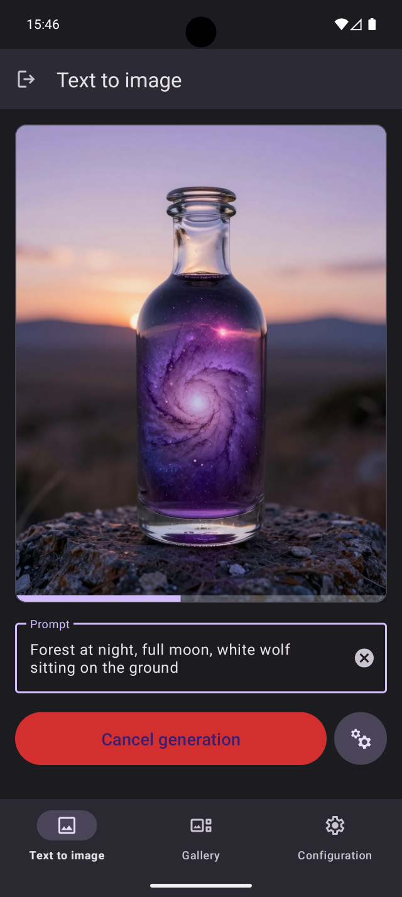
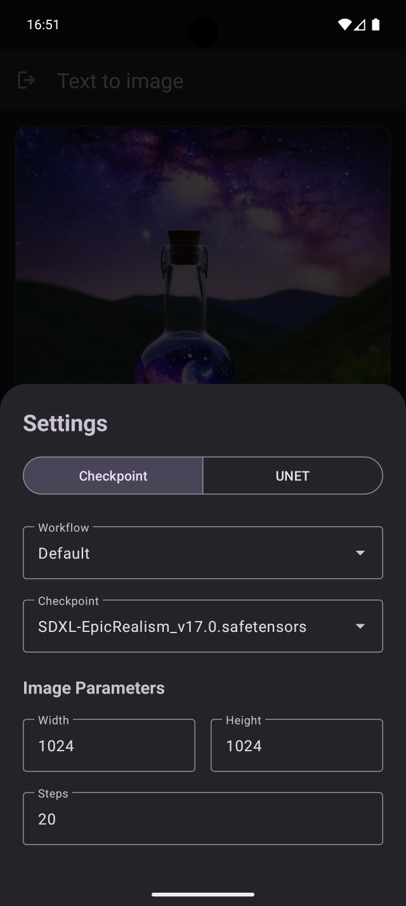
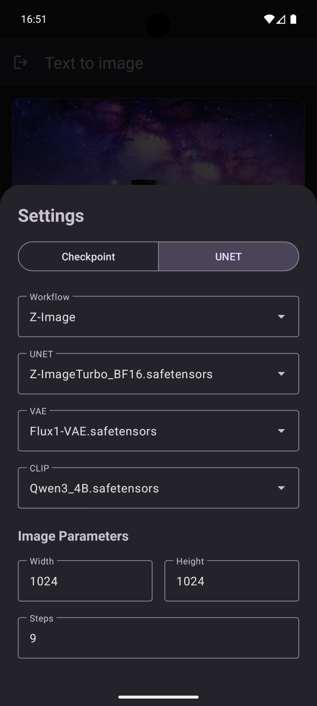
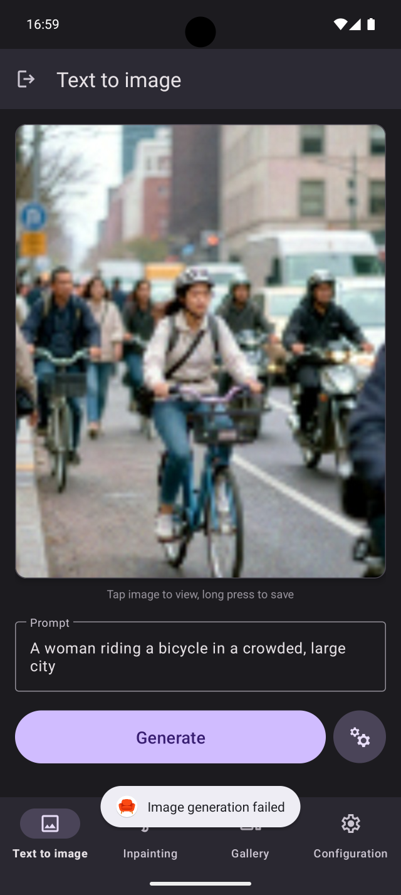

# ComfyChair

A simplified, mobile UI for [ComfyUI](https://github.com/comfyanonymous/ComfyUI) on Android.

**Current version**: v0.1.3

## Overview

ComfyChair provides a streamlined mobile interface for interacting with ComfyUI servers, allowing you to generate and manage AI images directly from your Android device. The app communicates with your ComfyUI server via its API, bringing the power of node-based AI image generation to your mobile workflow.

## Screenshots

       

## Features

- **Server connection**: Connect to remote or local ComfyUI servers with automatic HTTP/HTTPS detection and self-signed certificate support
- **Dual workflow support**:
  - **Checkpoint mode**: Traditional CheckpointLoaderSimple workflows
  - **UNET mode**: Modern diffusion workflows (Flux, Z-Image, etc.) with separate UNET, VAE, and CLIP model selection
- **Image generation**:
  - Mobile-optimized interface with real-time progress tracking
  - Visual progress bar overlay at bottom of image preview (square corners, fills left-to-right)
  - Cancel generation at any time with one-tap interrupt
  - WebSocket-based live updates showing step-by-step progress
  - Auto-clears prompt after successful generation
  - Error notifications via Toast messages
- **Image preview**:
  - Persistent image display across app sessions
  - App logo placeholder when no image is present
  - Tap to view fullscreen with pinch-to-zoom
  - Long press for save/share options
- **Image gallery**:
  - View all generated images with 2-column grid layout
  - Pull-to-refresh to update gallery
  - Newest images first
- **Image management**: Save to device gallery (Pictures/ComfyChair), save as file, or share images
- **Server configuration**:
  - View detailed server information (ComfyUI version, OS, Python, PyTorch versions)
  - Monitor hardware resources (RAM and GPU VRAM usage with free/total display)
  - Server management actions (clear queue, clear history)
- **Configuration persistence**: Automatically saves and restores all settings including prompts, models, workflow selections, and generation parameters for both modes
- **Persistent navigation**: Bottom navigation bar for seamless switching between text-to-image, gallery, and configuration screens
- **Native Android experience**: Built with Kotlin and Material Design 3

## Requirements

- Android 14 (API level 34) or higher
- Access to a running ComfyUI server instance
- Network connectivity to reach your ComfyUI server

## Development setup

### Prerequisites

1. **Android Studio** (latest stable version recommended)
2. **JDK 11** or higher
3. **Android SDK** with API level 36

### Building the project

1. Clone the repository:
   ```bash
   git clone <repository-url>
   cd ComfyChair
   ```

2. Set up your local environment:
   - Ensure `JAVA_HOME` is set to your JDK installation
   - Configure Android SDK path in `local.properties`

3. Build the app:
   ```bash
   ./gradlew assembleDebug
   ```

4. Run on device/emulator:
   ```bash
   ./gradlew installDebug
   ```

### Running tests

```bash
# Unit tests
./gradlew test

# Instrumented tests (requires device/emulator)
./gradlew connectedAndroidTest
```

## Configuration

To connect to your ComfyUI server, you'll need:
- ComfyUI server URL (e.g., `http://192.168.1.100:8188`)
- Network access between your Android device and the ComfyUI server

## Tech stack

- **Language**: Kotlin 2.0.21
- **Min SDK**: Android 14 (API 34)
- **Target SDK**: Android 15 (API 36)
- **Architecture**: Modern Android with AndroidX components
- **UI**: Material Design 3
- **Build system**: Gradle with Kotlin DSL

## Project structure

```
app/src/main/
├── java/sh/hnet/comfychair/
│   ├── MainActivity.kt              # Login/connection screen
│   ├── MainContainerActivity.kt     # Fragment container with persistent navigation
│   ├── TextToImageFragment.kt       # Image generation screen (fragment)
│   ├── GalleryFragment.kt           # Image gallery screen (fragment)
│   ├── ConfigurationFragment.kt     # Server configuration and management (fragment)
│   ├── GalleryAdapter.kt            # RecyclerView adapter for gallery grid
│   ├── ComfyUIClient.kt             # API client for ComfyUI server
│   ├── WorkflowManager.kt           # Workflow JSON management
│   └── SelfSignedCertHelper.kt      # SSL certificate handling
├── res/
│   ├── layout/                      # UI layouts
│   │   ├── activity_main.xml        # Login screen layout
│   │   ├── activity_main_container.xml  # Container with bottom navigation
│   │   ├── fragment_text_to_image.xml   # Generation screen layout
│   │   ├── fragment_gallery.xml     # Gallery screen layout
│   │   ├── fragment_configuration.xml   # Configuration screen layout
│   │   ├── bottom_sheet_config.xml  # Dual-mode generation configuration panel
│   │   ├── bottom_sheet_save_options.xml  # Save/share image options
│   │   ├── item_gallery_thumbnail.xml     # Gallery thumbnail item
│   │   └── dialog_fullscreen_image.xml    # Fullscreen image viewer
│   ├── raw/                         # Workflow JSON files
│   │   ├── checkpoint_default.json  # Default checkpoint workflow
│   │   └── unet_zimage.json         # Z-Image UNET workflow
│   ├── values/                      # Strings, themes, colors
│   ├── drawable/                    # Icons and graphics
│   └── xml/                         # Backup rules, file provider paths
└── AndroidManifest.xml
```

## Contributing

This project follows standard Android development practices:
- Kotlin coding conventions
- Material Design guidelines
- AndroidX compatibility

## License

[GPL-3.0](https://www.gnu.org/licenses/gpl-3.0.en.html)

## Acknowledgments

- [ComfyUI](https://github.com/comfyanonymous/ComfyUI) - The powerful node-based UI this app interfaces with
