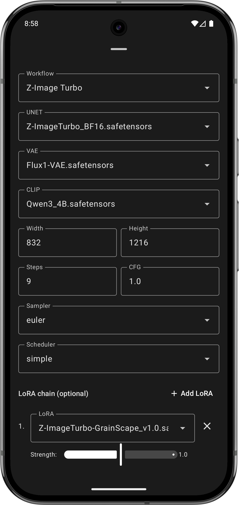
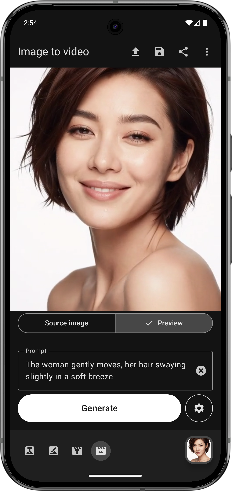
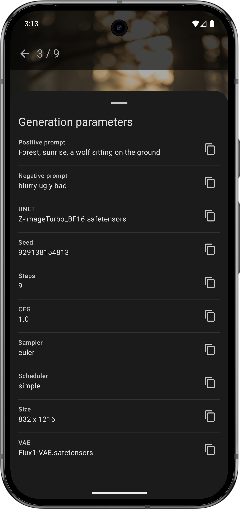
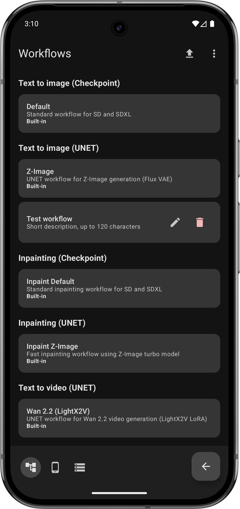
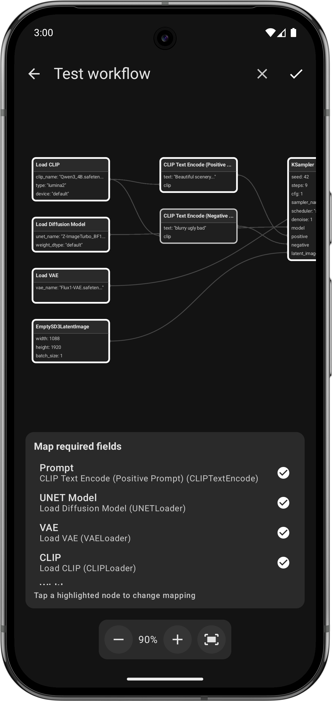

# ComfyChair

A simplified, mobile UI for [ComfyUI](https://github.com/comfyanonymous/ComfyUI) on Android.

**Current version**: v0.7.3

## Overview

ComfyChair provides a streamlined mobile interface for interacting with ComfyUI servers, allowing you to generate and manage AI images and videos directly from your Android device. The app communicates with your ComfyUI server via its API, bringing the power of node-based AI generation to your mobile workflow.

## Screenshots

          

## Features

- **Server connection**: Connect to remote or local ComfyUI servers with automatic HTTP/HTTPS detection and self-signed certificate support
- **Dual workflow support**:
  - **Checkpoint mode**: Traditional CheckpointLoaderSimple workflows
  - **UNET mode**: Modern diffusion workflows (Flux, Z-Image, etc.) with separate UNET, VAE, and CLIP model selection
- **LoRA chain support**:
  - Add up to 5 LoRAs per chain with individual strength control (0.0-2.0)
  - Text to image and Image to image: Separate LoRA chains for Checkpoint and UNET modes
  - Text to video and Image to video: Separate High noise and Low noise LoRA chains
  - LoRAs are dynamically injected into workflows at generation time
- **Text to image**:
  - Mobile-optimized interface
  - Cancel generation at any time with one-tap interrupt
  - WebSocket-based live updates showing step-by-step progress
  - Live preview images during generation (when supported by server)
  - Error notifications via Toast messages
- **Image to image**:
  - Two modes: **Editing** (transformation) and **Inpainting** (mask-based)
  - **Editing mode**:
    - Transform images without masks using AI editing
    - Optional reference images (up to 2) for guided transformation
    - Mandatory LoRA selection for editing workflows
    - Megapixels-based output sizing
  - **Inpainting mode**:
    - Upload source images for selective editing
    - Mask editor with paint/eraser toggle
    - Adjustable brush size with visual indicator
    - Feathered mask edges for smooth blending
    - Megapixels-based sizing for checkpoint workflows
  - WebSocket-based live updates showing step-by-step progress
  - Live preview images during generation (when supported by server)
  - Error notifications via Toast messages
- **Text to video**:
  - Generate AI videos with customizable parameters
  - High/low noise UNET and LoRA model selection
  - Live preview during generation
  - Save videos to device gallery or share
- **Image to video**:
  - Animate still images into videos
  - Upload source image with visual preview
  - High/low noise UNET and LoRA model selection
  - Adjustable video length and frame rate
  - Live preview during generation
  - Save videos to device gallery or share
- **Media viewer**:
  - Unified fullscreen viewer for images and videos
  - Swipe navigation between gallery items
  - Pinch-to-zoom
  - Double-tap to toggle between fit and crop zoom
  - Single-tap to toggle UI visibility (with system bars)
  - Quick actions: delete, save to gallery, share
  - Metadata viewer showing generation parameters (prompt, model, seed, steps, etc.)
  - Optimized media caching for smooth transitions between items
- **Gallery**:
  - View all generated images and videos with 2-column grid layout
  - Video indicator on thumbnails
  - Pull-to-refresh to update gallery
  - Multi-select mode with long press to select items
  - Batch operations: save, share, or delete multiple items at once
- **Media management**: Save to device gallery (Pictures/ComfyChair or Movies/ComfyChair) or share
- **Server configuration**:
  - View detailed server information (ComfyUI version, OS, Python, PyTorch versions)
  - Monitor hardware resources (RAM and GPU VRAM usage with free/total display)
  - Server management actions (clear queue, clear history)
- **App management**:
  - Clear local cache (generated images, videos, source images, masks)
  - Restore default settings
  - Backup configuration to JSON file (connection settings, workflow values, custom workflows)
  - Restore configuration from backup
- **Workflow management**:
  - View and manage custom workflows
  - Upload custom ComfyUI workflows with automatic validation
  - Visual workflow previewer with node graph display
  - Colored nodes and connections matching ComfyUI's visual style
  - Field mapping UI for required template fields
  - Edit workflow name and description
  - Default generation settings extracted during workflow import
  - Per-workflow generation settings (each workflow remembers its own configuration)
- **Configuration persistence**: Automatically saves and restores all settings including prompts, models, workflow selections, and generation parameters on a per-workflow basis
- **Persistent navigation**: Bottom navigation bar for seamless switching between screens
- **Localization**: Available in English (default), German, French, Polish, Spanish, and Chinese
- **Native Android experience**: Built with Kotlin and Jetpack Compose with Material Design 3

## Requirements

- Android 14 (API level 34) or higher
- Access to a running ComfyUI server instance
- Network connectivity to reach your ComfyUI server

## Development setup

### Prerequisites

1. **Android Studio** (latest stable version recommended)
2. **JDK 11** or higher
3. **Android SDK** with API level 36

### Building the project

1. Clone the repository:
   ```bash
   git clone https://github.com/legal-hkr/comfychair.git
   cd comfychair
   ```

2. Set up your local environment:
   - Ensure `JAVA_HOME` is set to your JDK installation
   - Configure Android SDK path in `local.properties`

3. Build the app:
   ```bash
   ./gradlew assembleDebug
   ```

4. Run on device/emulator:
   ```bash
   ./gradlew installDebug
   ```

### Running tests

```bash
# Unit tests
./gradlew test

# Instrumented tests (requires device/emulator)
./gradlew connectedAndroidTest
```

## Configuration

To connect to your ComfyUI server, you'll need:
- ComfyUI server URL (e.g., `http(s)://192.168.1.100:8188`)
- Network access between your Android device and the ComfyUI server

## Tech stack

- **Language**: Kotlin 2.0.21
- **Min SDK**: Android 14 (API 34)
- **Target SDK**: Android 15 (API 36)
- **UI Framework**: Jetpack Compose with Material Design 3
- **Video Playback**: Media3 ExoPlayer
- **Architecture**: MVVM with ViewModels and StateFlow
- **Navigation**: Jetpack Compose Navigation
- **Build system**: Gradle with Kotlin DSL

## Project structure

```
app/src/main/
├── java/sh/hnet/comfychair/
│   ├── MainActivity.kt              # Login/connection screen (Compose)
│   ├── MainContainerActivity.kt     # Main container with bottom navigation
│   ├── SettingsContainerActivity.kt # Settings container activity
│   ├── GalleryContainerActivity.kt  # Gallery container activity
│   ├── MediaViewerActivity.kt       # Fullscreen media viewer activity
│   ├── WorkflowPreviewerActivity.kt # Workflow preview activity
│   ├── ComfyUIClient.kt             # API client for ComfyUI server
│   ├── WorkflowManager.kt           # Workflow JSON management
│   ├── SelfSignedCertHelper.kt      # SSL certificate handling
│   ├── cache/
│   │   ├── MediaCache.kt            # In-memory media caching with prefetch
│   │   └── MediaStateHolder.kt      # Memory-first state for generation screens
│   ├── connection/
│   │   └── ConnectionManager.kt     # Central connection state singleton
│   ├── model/
│   │   ├── LoraSelection.kt         # LoRA selection data class
│   │   ├── SamplerOptions.kt        # Sampler and scheduler options
│   │   ├── WorkflowDefaults.kt      # Per-workflow default values
│   │   └── WorkflowValues.kt        # Per-workflow saved values
│   ├── navigation/
│   │   └── AppNavigation.kt         # Navigation route definitions
│   ├── storage/
│   │   ├── BackupManager.kt         # Configuration backup/restore
│   │   └── WorkflowValuesStorage.kt # Per-workflow value persistence
│   ├── viewmodel/
│   │   ├── GenerationViewModel.kt   # Central WebSocket & generation state
│   │   ├── TextToImageViewModel.kt  # Text to image screen state
│   │   ├── TextToVideoViewModel.kt  # Text to video screen state
│   │   ├── ImageToVideoViewModel.kt # Image to video screen state
│   │   ├── ImageToImageViewModel.kt   # Image to image screen state
│   │   ├── GalleryViewModel.kt      # Gallery screen state
│   │   ├── SettingsViewModel.kt     # Settings screen state
│   │   ├── MediaViewerViewModel.kt  # Media viewer state
│   │   ├── WorkflowManagementViewModel.kt  # Workflow management state
│   │   └── WorkflowPreviewerViewModel.kt   # Workflow previewer state
│   └── ui/
│       ├── theme/                   # Material 3 theme (Color, Type, Theme)
│       ├── screens/
│       │   ├── LoginScreen.kt       # Login/connection UI
│       │   ├── TextToImageScreen.kt # Text to image generation UI
│       │   ├── TextToVideoScreen.kt # Text to video generation UI
│       │   ├── ImageToVideoScreen.kt # Image to video generation UI
│       │   ├── ImageToImageScreen.kt  # Image to image UI
│       │   ├── GalleryScreen.kt     # Gallery UI with multi-select
│       │   ├── MediaViewerScreen.kt # Fullscreen media viewer UI
│       │   ├── ApplicationSettingsScreen.kt  # App settings UI
│       │   ├── ServerSettingsScreen.kt       # Server settings UI
│       │   ├── WorkflowsSettingsScreen.kt    # Workflow management UI
│       │   └── WorkflowPreviewerScreen.kt    # Workflow preview UI
│       ├── components/
│       │   ├── MainNavigationBar.kt          # Bottom navigation bar
│       │   ├── ConfigBottomSheetContent.kt   # Text to image config
│       │   ├── VideoConfigBottomSheetContent.kt  # Video config
│       │   ├── ImageToImageConfigBottomSheetContent.kt  # Image to image config
│       │   ├── MaskPaintCanvas.kt            # Compose Canvas mask painting
│       │   ├── MaskPreview.kt                # Mask preview component
│       │   ├── MaskEditorDialog.kt           # Fullscreen mask editor
│       │   ├── ImageViewer.kt                # Zoomable image viewer component
│       │   ├── VideoPlayer.kt                # ExoPlayer video component
│       │   ├── WorkflowGraphCanvas.kt        # Workflow node graph canvas
│       │   └── LoraChainEditor.kt            # LoRA chain editor component
│       └── navigation/
│           ├── MainNavHost.kt       # Main screen navigation
│           └── SettingsNavHost.kt   # Settings screen navigation
├── res/
│   ├── raw/                         # Workflow JSON files
│   │   ├── tti_checkpoint_sd.json                    # SD text to image
│   │   ├── tti_checkpoint_sdxl.json                  # SDXL text to image
│   │   ├── tti_checkpoint_sdxl_lcm_upscaler_latent.json   # SDXL LCM with latent upscaler
│   │   ├── tti_checkpoint_sdxl_light_upscaler_latent.json # SDXL Lightning with latent upscaler
│   │   ├── tti_checkpoint_sdxl_upscaler_latent.json  # SDXL with latent upscaler
│   │   ├── tti_checkpoint_flux_schnell.json          # Flux Schnell text to image
│   │   ├── tti_unet_flux.json                        # Flux text to image UNET
│   │   ├── tti_unet_zimage_turbo.json                # Z-Image Turbo text to image UNET
│   │   ├── ite_unet_qwenimage_lightning.json         # Qwen Lightning image editing UNET
│   │   ├── iti_checkpoint_sd.json                    # SD image to image (inpainting)
│   │   ├── iti_checkpoint_sdxl.json                  # SDXL image to image (inpainting)
│   │   ├── iti_unet_zimage_turbo.json                # Z-Image Turbo image to image UNET (inpainting)
│   │   ├── ttv_unet_wan22_lightning.json             # WAN 2.2 Lightning text to video UNET
│   │   └── itv_unet_wan22_lightning.json             # WAN 2.2 Lightning image to video UNET
│   ├── values/                      # Strings, themes, colors (English default)
│   ├── values-de/                   # German translations
│   ├── values-fr/                   # French translations
│   ├── values-pl/                   # Polish translations
│   ├── values-es/                   # Spanish translations
│   ├── values-zh/                   # Chinese translations
│   ├── drawable/                    # App icons
│   └── xml/                         # Backup rules, file provider paths
└── AndroidManifest.xml
```

## Contributing

This project follows standard Android development practices:
- Kotlin coding conventions
- Jetpack Compose best practices
- Material Design 3 guidelines
- MVVM architecture pattern

## License

[GPL-3.0](https://www.gnu.org/licenses/gpl-3.0.en.html)

## Acknowledgments

- [ComfyUI](https://github.com/comfyanonymous/ComfyUI) - The powerful node-based UI this app interfaces with
